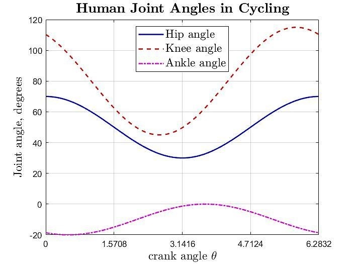

# cycling     

Interactive animation of cycling of lower body human skeleton using Coin3D (easy-to-use OpenInventor Library based on OpenGL), very useful and constructive for beginners in computer graphics or amateurs who are not planning to use OpenGL professionally. OpenInventor provides a very simple and easy-to-code API useful for many elementary and advanced computer graphics projects.

Written in modern C++ in Visual Studio 2019 Environment, and compatible only with 64-bit Windows, this project interactively animates the lower-body human skeleton in a cycling motion where the user has the ability to control the direction and speed of cycling using the arrow buttons of the keyboard. 

## 1- Pre-requisites

Pre-requisites for being able to run this project are as follows:

### 	A- Coin3D Library

This project requires Coin3D version 4 in order to work properly. In [section 3](#3--introduction-to-coin3d) you will find an introduction to Coin3D and how to install it. Coin3D is an OpenInventor library, and that in turn is an OpenGL API that is easy to work with, especially for beginners in computer graphics or amateurs who are not planning to do anything professional with OpenGL.

### 	B- 64-bit Windows Platform

Unfortunately the current version of this repository only works with 64-bit builds in windows. Current versions of Coin3D are not very compatible with 32-bit windows or 32-bit builds for some reason.

### 	C- (Optional) Microsoft Visual Studio v2014 and beyond

Albeit not strictly a "requirement", since this project was written in Visual Studio v2019 environment, it is easier to work with using Visual Studio 2014 and beyond. If you are using Windows or Mac for C++, there is a good chance some version of Visual Studio is already installed on your PC. Otherwise, click **[here](https://visualstudio.microsoft.com/)** to install the latest Visual Studio on your Windows or Mac.

If you do not have and are not interested in using Visual Studio, you will have to manually configure project properties. See [**here**](https://github.com/pniaz20/inventor-utils) for a guide on how to configure project properties so as to work with Coin3D on your computer.

## 2- Operation and Interaction

1. Open `Cycling.sln` if you are working with Visual Studio. Otherwise, open the `Source.cpp` source file, the only source file in this project.

2. Run the program in 64-bit (x64) debug build, not release.

3. When the console appears, check the messages in there and make sure the `.wrl` files (VRML graphics file to be imported) have been properly imported. See [**here**](https://github.com/pniaz20/inventor-utils) for an introduction into VRML and its compatibility with OpenInventor.

4. Wait for a few seconds and inside the console press Enter.

5. The scene viewer should open as follows:

   

   

6. Click on the 'select' icon.

7. Click anywhere on the skeleton to select it. You might receive a feedback on the console as well.
8. Press one of the arrow keys to interact with the skeleton in the following manners:
   - **UP-ARROW**: This button turns the crank counterclockwise if stationary, increases the cycling speed in 10 RPM increments by default, when turning counterclockwise. It decreases the cycling speed in 10 RPM increments by default when the crank is rotating clockwise. In other words, this button causes the crank to turn more clockwise. In technical terms, this button increments cycling speed by +10 RPM in right-handed coordinates.
   - **DOWN-ARROW**: This button turns the crank clockwise if stationary, increases cycling speed by 10 RPM by default in clockwise direction, and decreases cycling speed by 10 RPM by default in counterclockwise direction. That is, this button causes the crank to turn more clockwise each time it is pressed. In technical terms, this button increments cycling speed by -10 RPM in right-handed coordinates.
   - **LEFT-ARROW**: This is the STOP button. That is, it stops the skeleton normally, without cutting the animation. The crank would come to a normal stop, regardless of its speed and direction.
   - **RIGHT-ARROW**: This is the KILLSWITCH button. This button immediately cuts off the animation and resets the skeleton to its original orientation.
9. Gaze at the wonder and beauty of what you can see. Don't be shy, interact with the skeleton.
10. Close the scene viewer. At this moment the program will write the object with its current configuration into a `.iv` file, the default file format of Coin3D.

the program uses a slow acceleration for up and down arrows, and a fast deceleration rate when the left-button is pressed. These rates, as well as velocities and their increments can easily be modified in the source code, because they are all global variables.

You may realize that true RPMs are not exactly equal to real RPM values you can measure visually, and that is because I was using the timer engine instead of the animation engine for animating the object.

## 3- Introduction to Coin3D

Coin3D is an OpenInventor library for easily coding and generating computer graphics objects. It is much simpler to use than other OpenGL libraries and APIs, and is most useful for educational purposes, and for people who are not professional graphic designers, and want to build relatively simple graphics models in C++.

Coin3D is currently being held and maintained in [**this repository**](https://github.com/coin3d).

Even though the GitHub page of the repository includes [**instructions on how to install Coin3D on Windows, Mac and Linux**](https://github.com/coin3d/coin/wiki/BuildWithCMake), the installation instructions are somewhat confusing to follow. They also include installing Boost and CMake manually, none of which are necessary in fact. You would also have to install Coin and SoWin separately and build them separately. The present repository was written in Windows, and Coin3D library for windows appears to only support 64-bit builds as it turns out.

[**This GitHub repository of mine**](https://github.com/pniaz20/inventor-utils) includes the required Coin3D directory for **Windows**, as well as guidance and documentation on how to easily install and use Coin3D. It also has a sample code for testing if Coin3D is working properly in Windows.

If you want a very simple instruction set for installing Coin3D, simply follow the instructions on **[my repository](https://github.com/pniaz20/inventor-utils)**.

## 4- Cycling Motion

According to the paper written by [Ericson *et al.* [1]](doc/paper.pdf) (paper in `doc` folder), lower body joint angles move along sinusoidal trajectories in cycling motion. After visual approximation from the data provided by the authors on the figures, I came up with the following formula, which of course are not exact, but they will do.

$H^{\circ} = 50 + 20\cos(\theta)$

$K^{\circ} = 80 + 35 \cos(\theta + 30^{\circ})$

$A^{\circ} = -10-10\cos(\theta-30^{\circ})$

where $\theta=\omega t$ is the crank angle in degrees. All above formula are also in degrees. $H^{\circ}$ is the hip joint angle, denoted by $C$ in the paper, $K^{\circ}$ is the knee angle, and $A^{\circ}$ is the ankle joint angle, expressed in terms of *plantarflexion* and *dorsiflexion* . Figure below demonstrates them. Note, however, that crank angle $\theta$ is in radians in the figure below, ranging from 0 to $2\pi$.

## 5- VRML Models

The VRML models used in this project are as follows:

`left_femur.wrl`

`left_foot.wrl`

`left_pelvis.wrl`

`left_tibia.wrl`

`right_femur.wrl`

`right_foot.wrl`

`right_pelvis.wrl`

`right_tibia.wrl`

These models were generated in SolidWorks from a human skeleton model downloaded from [GrabCAD.com](https://grabcad.com/), then exported as VRML files, which could then be imported by Coin3D.

## 6- The Numerical Recipes classes

You may have noticed the existence of `nrutil.h` and `nrutil.cxx` files in the project folder, both of which are used in the project. This part belongs to an open-source C++ library called ***Numerical Recipes*** that provides easy functionality not only for declaring one-indexed vectors and matrices of various data types, but also coding many matrix-algebraic algorithms and methods in C++ using this library with relative ease. I only used them to make life easier for me when coding the numerical calculations in my code, but in case you are curious, the Numerical_Recipes folder contains the basic functions in abovementioned files, as well as two other files, `nr.h` and `nr.cpp`, as examples of how the subroutines explained in the Numerical Recipes textbook can be coded in C++ to generate functions that do many various matrix-algebraic operations.

The Numerical Recipes Textbook (`Numerical_Recipes\Numerical_Recipes_Book\\`) is given in both html and pdf formats. It includes mathematical explanations and sample codes for many useful and various mathematical, algebraic and matrix operations widely used in Engineering and Scientific fields.

## 7- License

This repository is MIT license, but OpenInventor and Coin3D have different licenses. Therefore, no matter where you get Coin3D from, its own repository or my repository, make sure you adhere to its terms of use. The same applies for the Numerical Recipes library.

## 8- References

| Number | Description                                                  |
| ------ | ------------------------------------------------------------ |
| [1]    | [M.O. Ericson, R. Nisell, and G, Nemeth, “Joint Motions of the Lower Limb During Ergometer Cycling”, *The Journal of Orthopaedic and Sports Physical Therapy*, Vol. 9, No. 8, pp. 273-278, 1988.](doc/paper.pdf) |

